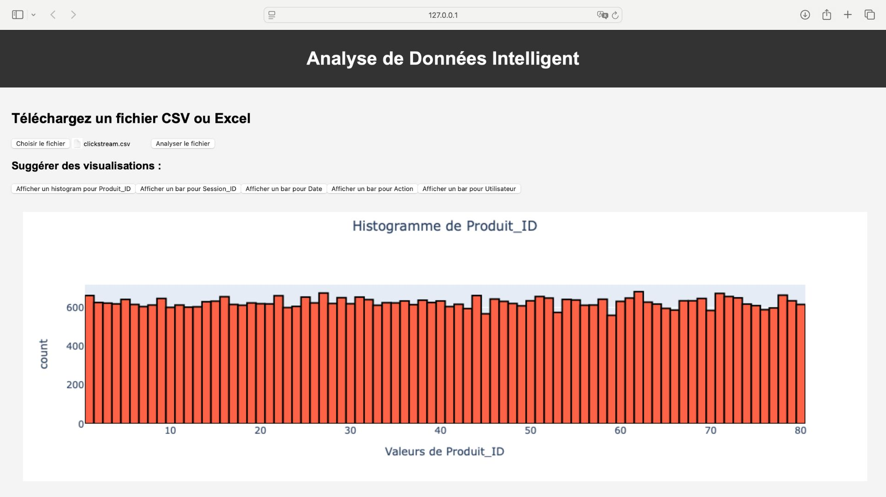

# Data Check

**Data Check** est une application développée en Python avec Flask permettant de télécharger des fichiers CSV ou Excel, d'analyser les données qu'ils contiennent et de proposer des visualisations graphiques adaptées.  
Ce projet est conçu pour aider à l'analyse des données en générant des graphiques utiles et des recommandations sur la meilleure manière de visualiser les informations.


## Aperçu de l'application



## Fonctionnalités

- Téléchargement de fichiers CSV ou Excel.
- Analyse des données contenues dans ces fichiers.
- Suggestions automatiques de visualisations graphiques adaptées (histogrammes, graphiques en barres, scatter plots, etc.).
- Affichage dynamique des graphiques via Plotly.

## Prérequis

Avant de commencer, assurez-vous que vous avez installé les éléments suivants :  

- **Python 3.x** (recommandé : 3.8 ou plus récent)  
- **Pip** (gestionnaire de paquets Python)
  
⚙️ Installation
### 1️⃣ Cloner le dépôt  
```bash
git clone https://github.com/Lemar00/Data_Check.git
cd Data_Check
```

2️⃣ Créer un environnement virtuel (optionnel mais recommandé)  
```bash
python -m venv venv
```
3️⃣ Activer l'environnement virtuel  

➜ Sur macOS/Linux  
```bash
source venv/bin/activate
```
4️⃣ Installer les dépendances  
```bash
pip install -r requirements.txt
```  
🚀 Lancer l'application  
Après l'installation, démarrez l'application Flask avec :
```bash
python app.py
```  
Puis ouvrez votre navigateur et accédez à :  
🔗 http://127.0.0.1:5000  

💡 Utilisation  
1️⃣ Téléchargez un fichier CSV ou Excel via l'interface.  
2️⃣ L'application analyse les données et propose des graphiques adaptés :  

Histogrammes 📊  
Graphiques en barres 📈  
Scatter plots 🔵  
Box plots 📦  

3️⃣ Sélectionnez une suggestion pour afficher un graphique interactif.  

🛠️ Technologies utilisées  
Flask : Framework web pour le backend.  
Pandas : Manipulation et analyse des données  
Plotly : Création de graphiques interactifs.  
Werkzeug : Gestion des fichiers uploadés.  

👨‍💻 Contributions  
Les contributions sont les bienvenues ! 🚀  
Si vous avez des idées d'amélioration ou des corrections de bugs :  
Ouvrez une issue 📝  
Soumettez une pull request 🔄  

📜 Licence  
Ce projet est sous licence MIT. Consultez le fichier LICENSE pour plus d'informations.
